# Report on the Neural Network Mode
### Predictive Binary Classifier for Funding Success: An Alphabet Soup Initiative


</br>

## Table of Contents: 

1. [Overview of the Analysis](#overview-of-the-analysis)

2. [Model Results](#results)

3. [Summary](#summary)

</br>

## **Overview of the Analysis**

- The purpose of this analysis is to leverage the dataset provided by Alphabet Soup, which consists of over 34,000 organizations that have received funding, to develop a binary classifier. This classifier will assist Alphabet Soup in selecting applicants for funding with the highest probability of success in their ventures. By utilizing machine learning and neural networks, we aim to create a predictive model that can determine whether applicants will be successful if funded by Alphabet Soup.

- To achieve this goal, the analysis involves several key steps. Firstly, we will thoroughly explore the dataset and examine the metadata columns capturing information about each organization. This will provide valuable insights into the features that may have a significant impact on the success of funded ventures.

- Next, we will preprocess and prepare the data, applying techniques such as data cleaning, feature engineering, and handling missing values. This step is crucial to ensure the quality and integrity of the dataset before training the binary classifier.

 
- Subsequently, we will delve into the implementation of machine learning algorithms and neural networks. Through model selection and optimization, we will identify the most suitable approach to develop a robust binary classifier. This classifier will utilize the dataset's features to predict the likelihood of success for applicants receiving funding from Alphabet Soup.

 
- To evaluate the performance of the binary classifier, we will employ appropriate metrics and validation techniques. This will allow us to measure the accuracy and reliability of the model's predictions and assess its effectiveness in distinguishing successful ventures from unsuccessful ones.

- The results and insights obtained from this analysis will provide Alphabet Soup with a powerful tool for decision-making in their funding selection process. By accurately predicting the success of applicants, Alphabet Soup can strategically allocate their resources, support ventures with the greatest potential, and increase the overall impact of their philanthropic efforts.

- In conclusion, this analysis aims to leverage machine learning techniques to develop a binary classifier that can predict the success of ventures funded by Alphabet Soup. By providing an overview of the methodology, analysis, and expected outcomes, this report will enable Alphabet Soup to make informed decisions and optimize their funding decisions for maximum impact.

</br>


## **Results**

</br>

### &nbsp;&nbsp;&nbsp;&nbsp;&nbsp;&nbsp;&nbsp;&nbsp;&nbsp;&nbsp;&nbsp;&nbsp;&nbsp;&nbsp;&nbsp;&nbsp;&nbsp;&nbsp;&nbsp;&nbsp;&nbsp;&nbsp;&nbsp;&nbsp;&nbsp;&nbsp;&nbsp;&nbsp;&nbsp;&nbsp;&nbsp;&nbsp;&nbsp;&nbsp;&nbsp;&nbsp;&nbsp;&nbsp;&nbsp;&nbsp;&nbsp;&nbsp;&nbsp;Data Preprocessing

</br>

* Drop the non-beneficial ID columns, 'EIN' and 'NAME', because they are neither targets nor features.
```
# Drop the non-beneficial ID columns, 'EIN' and 'NAME'.
application_df=application_df.drop(columns=['EIN', 'NAME'], axis=1)
application_df.head()
```
* Choose a cutoff value and create a list of application types to be replaced
```
# use the variable name `application_types_to_replace`

application_types_to_replace = list(app_type_count[app_type_count<500].index)
# Replace in dataframe
for app in application_types_to_replace:
    application_df['APPLICATION_TYPE'] = application_df['APPLICATION_TYPE'].replace(app,"Other")

# Check to make sure binning was successful
application_df['APPLICATION_TYPE'].value_counts()
```

* Choose a cutoff value and create a list of classifications to be replaced
```
# use the variable name `classifications_to_replace`

classifications_to_replace = list(class_count[class_count < 1000].index)
# Replace in dataframe
for cls in classifications_to_replace:
    application_df['CLASSIFICATION'] = application_df['CLASSIFICATION'].replace(cls,"Other")
    
# Check to make sure binning was successful
application_df['CLASSIFICATION'].value_counts()
```

- Convert categorical data to numeric with `pd.get_dummies`
```
numeric_application_df= pd.get_dummies(application_df)
numeric_application_df
```

- Split our preprocessed data into our features and target arrays 
```
y=numeric_application_df['IS_SUCCESSFUL']
X=numeric_application_df.drop(['IS_SUCCESSFUL'], axis=1)
```
`Target Variable for the model`
-  IS_SUCCESSFUL,</br>

`Feature Variables for the model`
- APPLICATION_TYPE
- AFFILIATION
- CLASSIFICATION
- USE_CASE
- ORGANIZATION
- STATUS
- INCOME_AMT
- SPECIAL_CONSIDERATIONS
- ASK_AMT

</br>

### &nbsp;&nbsp;&nbsp;&nbsp;&nbsp;&nbsp;&nbsp;&nbsp;&nbsp;&nbsp;&nbsp;&nbsp;&nbsp;&nbsp;&nbsp;&nbsp;&nbsp;&nbsp;&nbsp;&nbsp;&nbsp;&nbsp;&nbsp;&nbsp;&nbsp;&nbsp;&nbsp;&nbsp;&nbsp;&nbsp;&nbsp;&nbsp;&nbsp;&nbsp;&nbsp;&nbsp;&nbsp;&nbsp;&nbsp;&nbsp;&nbsp;&nbsp;&nbsp; Compile, Train and Evaluate the Model

</br>
For the model compilation, training, and evaluation, I opted to design a deep neural network with the following configuration:

The input (node) feature was determined to be 43, and I chose to have 80 neurons in the first hidden layer, which is almost double the input feature count. I made this choice considering the relatively low computation time required.
The activation function for the hidden layers was set to 'relu', which is a commonly used activation function for the initial model.
Since the model is a binary classifier with a single output (indicating whether the funding application was successful or not), I used a single output node. The output layer was assigned the 'sigmoid' activation function, as it suits binary classification with output values ranging from 0 to 1. 
<p align="center">

  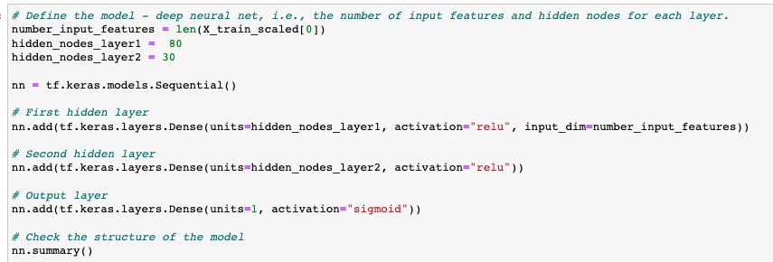

</p>
The accuracy was 0.726.

<p align="center">
  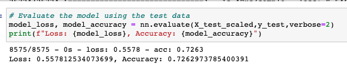

</p>
I treated the 'Name' column by replacing names with a count less than 5 as 'Other' without dropping the column, which increased the number of features to 446. The accuracy was 0.79043. 
</p>


<p align="center">
  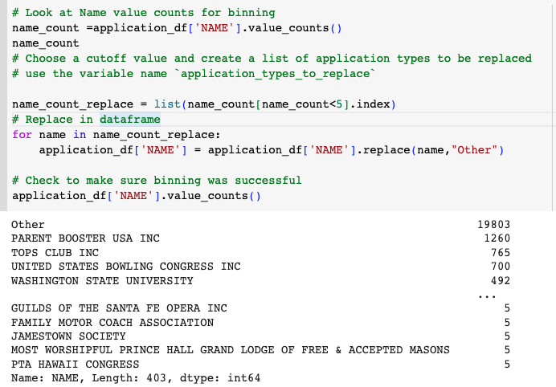

</p>
The accuracy was 0.7904.

<p align="center">

  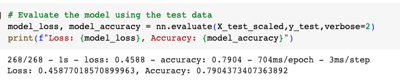

</p>
Therefore, I attempted to include all values of the 'Name' column to see the outcome. In this case, the number of features increased to 19,611. Concerned about the potential problems of overfitting, increased computational complexity, and feature redundancy and irrelevance caused by having too many features, I decided to proceed with optimization tuning.

<p align="center">

  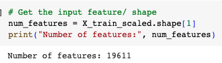

</p>

</br>

### &nbsp;&nbsp;&nbsp;&nbsp;&nbsp;&nbsp;&nbsp;&nbsp;&nbsp;&nbsp;&nbsp;&nbsp;&nbsp;&nbsp;&nbsp;&nbsp;&nbsp;&nbsp;&nbsp;&nbsp;&nbsp;&nbsp;&nbsp;&nbsp;&nbsp;&nbsp;&nbsp;&nbsp;&nbsp;&nbsp;&nbsp;&nbsp;&nbsp;&nbsp;&nbsp;&nbsp;&nbsp;&nbsp;&nbsp;&nbsp;&nbsp;&nbsp;&nbsp; Optimize the Model

</br>
I increased the number of hidden layers up to 5 and allowed Kerastuner to decide which activation function to use in the hidden layers: 'activation' ('relu', 'tanh', 'LeakyReLU').

<p align="center">

  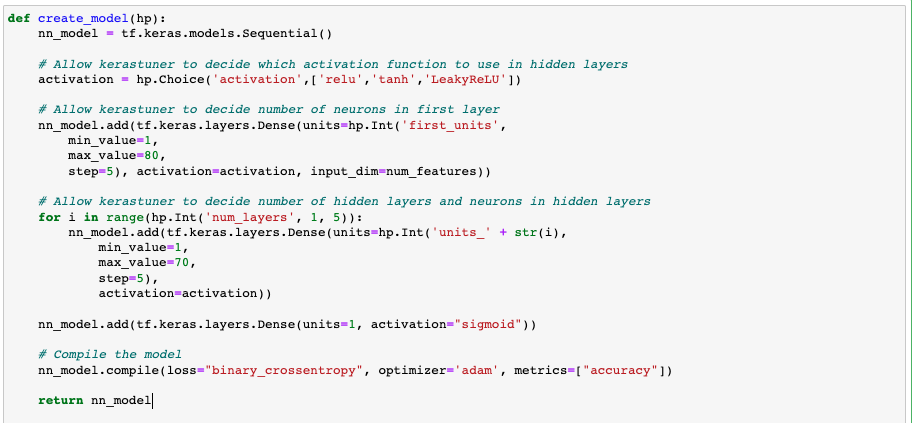

</p>
<p align="center">

  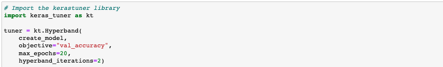

</p>

When I classified the 'Name' column as 'Other' for Name count < 5 and performed tuning, I obtained results with accuracy below 80%. Therefore, I changed it to Name count < 3, which increased the number of features to 662.

<p align="center">

  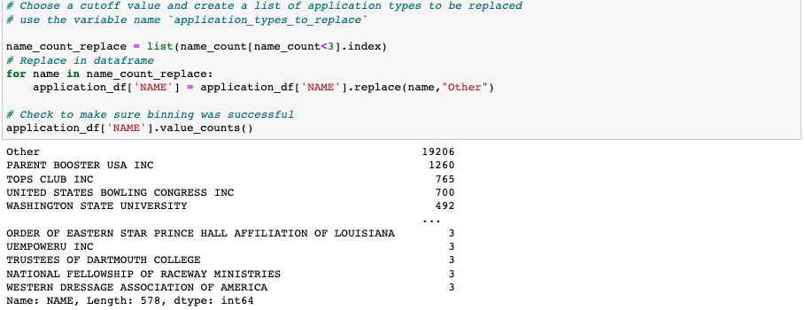

</p>
<p align="center">

  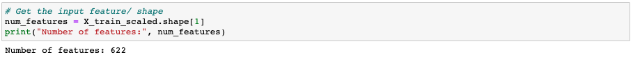

</p>


As a result, I was able to achieve an increase in accuracy up to 0.8000.

<p align="center">

  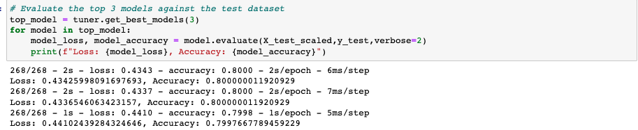

</p>
<p align="center">

  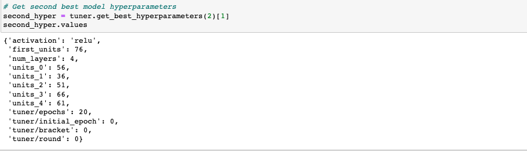

</p>


## **Summary**


`In the preprocessing stage, when the Name column was mistakenly recognized as a non-beneficial ID column, the accuracy hovered around 72%. By classifying Name column with Name count < 3 as 'Other,' the number of features increased up to 622. Utilizing this data, the accuracy could be raised up to 79%. This indicates the importance of determining whether a column is a beneficial ID column or not in the preprocessing stage`

</br>

`It was observed that increasing the number of hidden layers up to five resulted in an increase in accuracy to the 80% range.`
`However Increasing the number of hidden layers can result in overfitting, increased computational complexity, gradient vanishing or exploding, and difficulties in model design. It is crucial to strike a balance between model performance and computational efficiency when adding hidden layers.`
